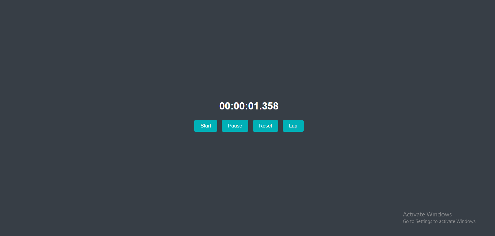

# Internship Task 2 - Web Development

# Project Title: Responsive Landing Page

This is Task 2 of the CodeCraft Web Development Internship. The task was to build a stopwatch application using HTML, CSS, and JavaScript.

---

# Folder Structure

```
 # Task 2
 ┣ assets
 ┃ ┗Task 2.png               # Screenshot of the live output
 ┣ index.html              # Main HTML file
 ┣ style.css               # Styling using CSS
 ┣ script.js               # JavaScript functionality (if any)
 ┗ README.md               # Project documentation
```

---

# Technologies Used

- HTML5
- CSS3
- JavaScript (basic)
- Live Server (for testing)

---

# Preview



---

# Instructions

- Clone or download the repository.
- Open `index.html` in any modern browser or use Live Server for best results.
- View the layout and responsiveness of the landing page.

---

# Created By

**Sandeep Kumar**  
Web Development Intern @ CodeCraft Infotech

---

# Repository Link

[🔗 GitHub Repository](https://github.com/Sandeep-Kumar16/CODECRAFT_WD_01)
